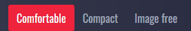

## A Refreshing news App built with React and Typescript


### Prominent Features

- Read Top Headlines from 7 different countries( US, UK, IN, FR, DE, AU, CA).
  
  

- Filter and read Headlines by category (General, Business, Entertainment, Health, Science,     Sports, Technology).
  
  

- Read news in three different Modes (Comfortable, Compact, Image free).
  
  

- Search across millions of news articles using the search feature. Due to the api limitation the search is limited today, this week and this month.
  
  

## How to run & build the project
- Clone the project locally and run
  ```javascript
    npm install
  ```
- To run the project
  ```javascript
    npm run start
  ```
- To generate a Production build
  ```javascript
    npm run build
  ```  
## Todo

- The pagination on the search function needs to be fixed.