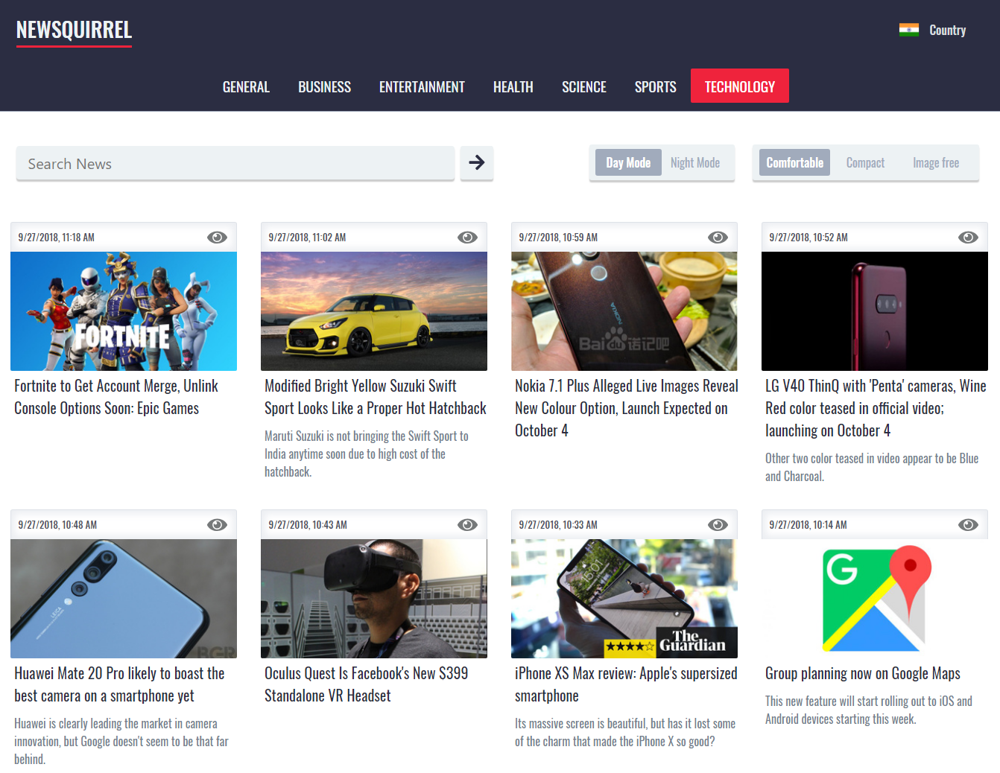
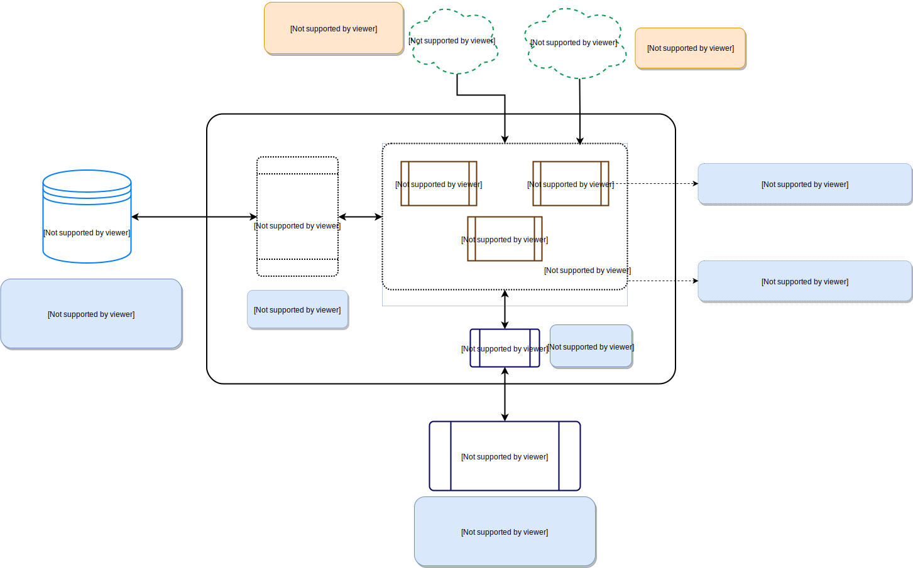

## Newsquirrel

<a href="https://codeclimate.com/github/prabhuignoto/newsquirrel/maintainability">
[](https://github.com/styled-components/styled-components)
[](https://github.com/reduxjs/redux)
[](https://www.typescriptlang.org/)

### A Refreshingly simple News reader.



### Features

* Read News Headlines from 7 different countries( US, UK, IN, FR, DE, AU, CA).
* Switch between news categories easily.
* Three different reading Modes (Comfortable, Compact and Image free).
* Night mode for a pleasant news reading experience.
* Responsive and built from the ground up to run seamlessly on mobiles, tablets and desktop.
* QuickPreview for instantly viewing News articles.
* Powered by News API, Search for articles from over 30,000 news sources and blogs.

### Getting Started

Clone the project locally and the follow the steps below for dev/build.

### Installing

Get started by installing the project dependencies. You can alternatively use npm for dev & build.

```javascript
yarn install
```

### Running in dev mode

```javascript
yarn run start
```

### To generate a production build

```javascript
yarn run build
```

### Built With

Newsquirrel is powered by some of the best in class tools and frameworks

* [React](https://github.com/facebook/react) - JavaScript library for building user interfaces.
* [Typescript](https://github.com/Microsoft/TypeScript) - Typings System.
* [Emotion](https://github.com/emotion-js/emotion) - The Next Generation of CSS-in-JS
* [Apollo](https://www.apollographql.com/) - Build a universal GraphQL API on top of your existing REST APIs
* [Graphql](https://graphql.org/) - A query language for your API
* [Docker](https://www.docker.com/) - Build, Manage and Secure Your Apps Anywhere. Your Way
* [Kubernetes](https://kubernetes.io/) - Production-Grade Container Orchestration

### Architecture

* **Web** - This is the front end app hosted on NGINX and is where all the action starts.
* **Newsapi** - Apollo-Server is responsible for handling all the requests coming from the web app. The server talks to the news API and caches the data on a MYSQL db for a faster data retrieval.
* **Prisma Service** - A GraphQL endpoint which the newsapi uses for storing the data on MYSQL db. It acts a ORM layer for the MYSQL db.
* **Database** - A MYSQL database used for caching purpose.

### Architecture Diagram



### Docker Ready

Both the front-end app as well as the application server are **Dockerized** and can easily be deployed to any Orchestration engine of choice. The App (http://squirrel.prabhumurthy.com) is currently deployed to a Kubernetes Cluster on Google's Cloud platform.

### What is coming next

* Ability to share news articles on Social Media.
* Integration with Pocket API to save news for later reading.

### Authors

* **Prabhu Murthy** - *Initial work* - [prabhuignoto](https://github.com/prabhuignoto)

### License

This project is licensed under the MIT License - see the [LICENSE.md](LICENSE.md) file for details